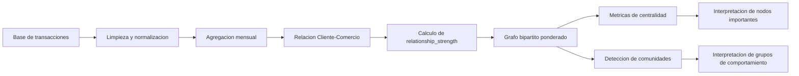
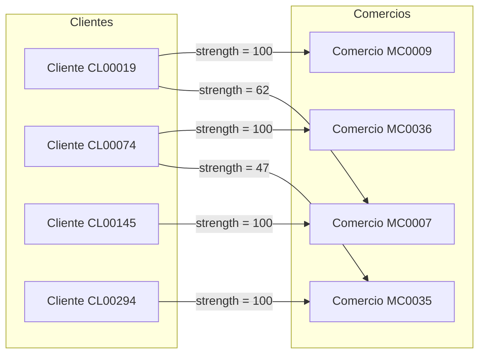
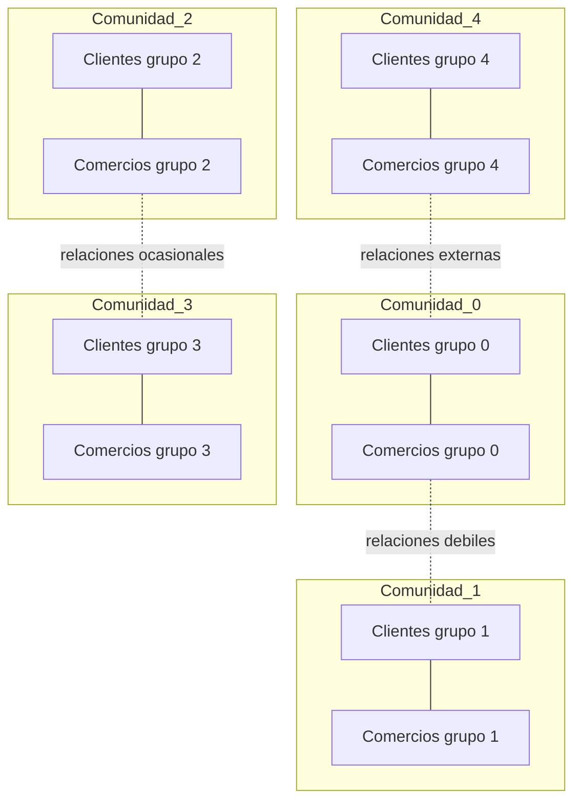

# Aplicacion de teoria de grafos para analizar confianza transaccional Cliente-Comercio

## A. Resumen

Este proyecto aplica teoria de grafos a un contexto realista de transacciones entre clientes y comercios. El problema propuesto consiste en identificar relaciones fuertes, entidades centrales y comunidades dentro de una red transaccional Cliente-Comercio. Este tipo de analisis puede ser usado por entidades financieras, redes adquirentes, comercios electronicos o sistemas de monitoreo transaccional para comprender patrones de comportamiento, detectar concentraciones de actividad y observar posibles deterioros de confianza.

Debido a que las bases reales de transacciones financieras contienen informacion sensible, se utilizo una base de datos sintetica generada por simulacion. La base conserva una estructura similar a la de un sistema real: identificador de cliente, tarjeta, comercio, NIT, fecha de transaccion, monto, estado de aprobacion, categoria del comercio y fecha de afiliacion. El conjunto contiene 37.501 transacciones, 300 clientes, 50 comercios y 18 meses de actividad.

El modelo se construyo como un grafo bipartito, donde un grupo de nodos representa clientes y el otro grupo representa comercios. Las aristas conectan clientes con comercios cuando existe una relacion transaccional. Cada arista tiene un peso denominado `relationship_strength`, calculado a partir de la frecuencia de transacciones, la participacion del comercio dentro del comportamiento del cliente, el monto transado y la persistencia de la relacion en el tiempo.

Sobre el grafo se aplicaron metricas de centralidad, especialmente grado, grado ponderado y PageRank. Tambien se aplico deteccion de comunidades con el algoritmo Louvain sobre proyecciones del grafo bipartito. Los resultados muestran una red de 350 nodos y 907 relaciones fuertes en el ultimo mes analizado. Se identificaron 5 comunidades de clientes y 5 comunidades de comercios, lo que indica que la simulacion produjo grupos diferenciados de comportamiento transaccional. Los comercios mas centrales fueron `MC0029`, `MC0024`, `MC0028`, `MC0007` y `MC0037`, lo que sugiere que concentran relaciones frecuentes, persistentes o con mayor peso dentro de la red.

## B. Metodologia

### 1. Investigacion y seleccion del problema

La teoria de grafos permite representar objetos y relaciones mediante nodos y aristas. En contextos reales se aplica, por ejemplo, para calcular rutas mas cortas en mapas, detectar comunidades en redes sociales, analizar cadenas de suministro, construir arboles recubridores en redes de comunicacion, evaluar dependencia entre variables y estudiar redes financieras.

Para este proyecto se selecciono el problema de analizar una red transaccional Cliente-Comercio. En este contexto, la teoria de grafos es adecuada porque una transaccion no solo describe un evento aislado, sino tambien una relacion entre dos entidades. Cuando estas relaciones se acumulan en el tiempo, se puede estudiar la estructura general de la red: quienes son los clientes mas conectados, cuales comercios son mas relevantes, que relaciones son mas fuertes y que grupos de entidades forman comunidades.

### 2. Datos utilizados

Se utilizaron datos sinteticos generados por el modulo `src/synthetic.py`. La simulacion crea clientes, comercios, tarjetas, categorias MCC, fechas de afiliacion, montos transaccionales y estados de aprobacion o rechazo. Tambien incorpora afinidades persistentes entre ciertos clientes y comercios, para que la red tenga una estructura de comunidades semejante a la observada en sistemas reales.

Resumen de la base utilizada:

| Variable | Valor |
|---|---:|
| Transacciones | 37.501 |
| Clientes unicos | 300 |
| Comercios unicos | 50 |
| Meses analizados | 18 |
| Monto total transado | 1.525.654.447,50 |
| Tasa de aprobacion | 96,47% |

Columnas principales del dataset:

| Columna | Descripcion |
|---|---|
| `cedula_cliente` | Identificador sintetico del cliente |
| `id_tarjeta` | Identificador sintetico de tarjeta |
| `codigo_unico_comercio` | Identificador sintetico del comercio |
| `nit_comercio` | NIT simulado del comercio |
| `fecha_transaccion` | Fecha y hora de la transaccion |
| `monto_transaccion` | Valor monetario de la transaccion |
| `estado_transaccion` | Estado aprobado o rechazado |
| `mcc` | Categoria del comercio |
| `fecha_afiliacion` | Fecha de afiliacion del comercio |

### 3. Modelado con grafos

El problema se modelo como un grafo bipartito no dirigido:

\[
G = (V, E)
\]

Donde:

\[
V = C \cup M
\]

`C` representa el conjunto de clientes y `M` representa el conjunto de comercios. Una arista existe si un cliente realizo transacciones con un comercio durante el periodo analizado:

\[
e_{ij} = (cliente_i, comercio_j)
\]

Cada arista tiene un peso:

\[
w_{ij} = relationship\_strength_{ij}
\]

El peso resume la fortaleza de la relacion Cliente-Comercio. Este indicador toma valores entre 0 y 100 y considera persistencia, participacion de la relacion dentro del comportamiento del cliente, monto transado y continuidad mensual.

### Ilustracion conceptual del modelo

El proceso general del proyecto puede representarse de la siguiente manera:



La siguiente figura ilustra la estructura basica del grafo bipartito. Los clientes solo se conectan con comercios, y cada conexion tiene un peso asociado a la fortaleza de la relacion.



En esta representacion, una arista con valor cercano a 100 indica una relacion muy fuerte. Esto puede deberse a compras recurrentes, alta participacion de ese comercio dentro del comportamiento del cliente o continuidad durante varios meses.

### 4. Construccion del indicador de confianza

El proyecto calcula dos tipos de indicadores relacionados, pero con funciones distintas:

| Indicador | Nivel | Funcion dentro del proyecto |
|---|---|---|
| `relationship_strength` | Relacion Cliente-Comercio | Peso de la arista en el grafo |
| `trust_score` | Cliente o comercio | Indicador mensual de confianza comportamental |

El indicador no representa una probabilidad de fraude. Su objetivo es medir consistencia, estabilidad y fortaleza del comportamiento observado. Por tanto, un valor alto significa que la entidad mantiene un comportamiento transaccional estable, persistente y con relaciones recurrentes; un valor bajo indica menor consistencia o deterioro relativo.

#### 4.1. Fortaleza de relacion Cliente-Comercio

Primero se calcula `relationship_strength`, que es el peso de cada arista del grafo. Para cada par Cliente-Comercio y cada mes se agregan las transacciones y se calculan variables como numero de transacciones, monto total, tasa de aprobacion, participacion de la relacion dentro del total mensual del cliente y persistencia historica.

La formula usada es:

\[
relationship\_strength = 100 \times (0.40A + 0.25B + 0.20C + 0.15D)
\]

Donde:

| Componente | Significado | Peso |
|---|---|---:|
| `A = relation_active_month_ratio` | Proporcion de meses activos de la relacion en una ventana de 6 meses | 40% |
| `B = client_tx_share` | Participacion de esa relacion dentro del numero de transacciones del cliente | 25% |
| `C = client_amount_share` | Participacion de esa relacion dentro del monto transado por el cliente | 20% |
| `D = relation_streak_months / 6` | Racha de meses consecutivos con actividad en la relacion | 15% |

Esta ponderacion da mayor importancia a la persistencia. Por ejemplo, una compra aislada puede tener monto alto, pero no necesariamente representa una relacion fuerte. En cambio, una relacion que aparece durante varios meses consecutivos y representa una parte importante de las compras del cliente recibe mayor peso.

#### 4.2. Trust Score de clientes

Despues de construir las relaciones, se calcula un `trust_score` mensual para cada cliente. Este indicador combina cuatro dimensiones:

| Dimension | Descripcion | Peso |
|---|---|---:|
| Persistencia | Proporcion de meses activos del cliente en una ventana de 12 meses | 25% |
| Estabilidad | Regularidad del numero de transacciones, monto y ticket promedio en ventana movil | 25% |
| Calidad | Tasa de aprobacion de las transacciones | 20% |
| Fidelidad relacional | Persistencia y fortaleza promedio de las relaciones con comercios | 30% |

La estabilidad se calcula con el coeficiente de variacion. Si la actividad es muy variable, la confianza disminuye. El score de estabilidad usa la transformacion:

\[
score\_estabilidad = \frac{100}{1 + CV}
\]

Asi, si el coeficiente de variacion es 0, la estabilidad es 100; si el coeficiente de variacion es 1, la estabilidad baja a 50.

La formula general para clientes es:

\[
Trust\_cliente = 0.25P + 0.25E + 0.20Q + 0.30F
\]

Donde `P` es persistencia, `E` es estabilidad, `Q` es calidad y `F` es fidelidad relacional.

#### 4.3. Trust Score de comercios

Para los comercios se calcula un indicador similar, pero adaptado a su rol dentro de la red. Las dimensiones son:

| Dimension | Descripcion | Peso |
|---|---|---:|
| Persistencia | Proporcion de meses activos del comercio en una ventana de 12 meses | 20% |
| Estabilidad | Regularidad de transacciones, monto y ticket promedio | 25% |
| Calidad | Tasa de aprobacion de transacciones | 15% |
| Recurrencia de clientes | Proporcion de clientes recurrentes y fortaleza promedio de relacion | 30% |
| Diversificacion | Menor dependencia de pocos clientes, calculada con HHI | 10% |

La formula general para comercios es:

\[
Trust\_comercio = 0.20P + 0.25E + 0.15Q + 0.30R + 0.10D
\]

Donde `P` es persistencia, `E` es estabilidad, `Q` es calidad, `R` es recurrencia de clientes y `D` es diversificacion.

La diversificacion se basa en el indice HHI, que mide concentracion. Si un comercio depende demasiado de pocos clientes, su diversificacion disminuye. El proyecto usa:

\[
Diversificacion = 100 \times (1 - HHI)
\]

#### 4.4. Bandas de interpretacion

Finalmente, el score se clasifica en bandas para facilitar la interpretacion:

| Rango | Banda |
|---|---|
| Menor que 50 | Baja |
| 50 a 69,99 | Media |
| 70 a 84,99 | Alta |
| 85 o mas | Muy alta |

El modelo tambien calcula cambios mensuales (`trust_change_1m`) y cambios trimestrales (`trust_change_3m`). Esto permite observar deterioros o mejoras en el comportamiento de clientes y comercios a traves del tiempo.

#### 4.5. Como interpretar el valor total de confianza

El `trust_score` final se interpreta como una medida de confianza comportamental entre 0 y 100. No debe entenderse como una calificacion moral del cliente o comercio, ni como una probabilidad directa de fraude. Es un indicador de que tan consistente, estable, recurrente y saludable ha sido el comportamiento transaccional observado.

Una interpretacion practica puede ser:

| Trust score | Interpretacion | Posible accion |
|---|---|---|
| 85 a 100 | Confianza muy alta | Mantener condiciones normales, priorizar fidelizacion o beneficios comerciales |
| 70 a 84,99 | Confianza alta | Operar normalmente y hacer seguimiento periodico |
| 50 a 69,99 | Confianza media | Revisar cambios recientes, monitorear estabilidad y recurrencia |
| Menor que 50 | Confianza baja | Analizar manualmente, revisar deterioros, rechazos o dependencia excesiva |

Este indicador puede usarse para apoyar decisiones como segmentacion de clientes, monitoreo de comercios importantes, deteccion de deterioros de comportamiento, priorizacion de relaciones comerciales y analisis de comunidades dentro de la red.

Sin embargo, el `trust_score` no debe usarse por si solo para bloquear transacciones, acusar fraude, negar servicios o tomar decisiones sancionatorias. Para ese tipo de acciones se requeririan variables adicionales, reglas de negocio, validacion con datos reales, etiquetas historicas de fraude o incumplimiento, y revision humana. En este proyecto, el valor de confianza sirve principalmente como una herramienta exploratoria y analitica para entender la estructura de la red transaccional.

### 5. Algoritmos aplicados

#### PageRank

PageRank estima la importancia relativa de un nodo dentro de la red. En este proyecto se aplica sobre el grafo ponderado, por lo que un comercio o cliente recibe mayor importancia si esta conectado con entidades relevantes y si sus relaciones tienen mayor peso.

En el contexto transaccional, un PageRank alto puede interpretarse como una posicion estructural importante dentro de la red. No significa necesariamente mayor riesgo o fraude, sino mayor centralidad relacional.

#### Grado y grado ponderado

El grado mide el numero de conexiones de un nodo. El grado ponderado suma los pesos de sus relaciones. Un comercio con grado alto se relaciona con muchos clientes; un comercio con grado ponderado alto tiene relaciones fuertes o persistentes.

#### Deteccion de comunidades Louvain

El metodo Louvain busca particiones de la red que maximizan la modularidad. Una comunidad es un grupo de nodos con mas conexiones internas que externas. En este proyecto se usa para identificar grupos de clientes y comercios que tienden a relacionarse entre si.

### 6. Pseudocodigo

```text
Entrada:
    Base de transacciones con cliente, comercio, fecha, monto y estado

Proceso:
    1. Cargar la base de transacciones
    2. Detectar y normalizar columnas relevantes
    3. Agrupar transacciones por cliente, comercio y mes
    4. Calcular variables de relacion:
        - numero de transacciones
        - monto total
        - tasa de aprobacion
        - participacion dentro del cliente
        - persistencia mensual
        - racha de relacion
    5. Calcular relationship_strength para cada par Cliente-Comercio
    6. Construir un grafo bipartito:
        - nodos tipo cliente
        - nodos tipo comercio
        - aristas ponderadas por relationship_strength
    7. Filtrar relaciones con peso minimo significativo
    8. Calcular metricas del grafo:
        - grado
        - grado ponderado
        - PageRank
    9. Proyectar el grafo por tipo de nodo:
        - proyeccion de clientes
        - proyeccion de comercios
    10. Aplicar Louvain para detectar comunidades
    11. Exportar resultados en archivos CSV y GraphML

Salida:
    Tabla de metricas, comunidades detectadas y grafo exportado
```

## C. Resultados

### 1. Construccion del grafo

Despues de procesar los datos sinteticos, se construyo un grafo bipartito Cliente-Comercio. Para evitar relaciones debiles u ocasionales, se conservaron las relaciones con `relationship_strength >= 30` en el ultimo mes disponible.

Resultados generales del grafo:

| Metrica | Resultado |
|---|---:|
| Nodos totales | 350 |
| Clientes | 300 |
| Comercios | 50 |
| Relaciones fuertes en el ultimo mes | 907 |
| Comunidades de clientes | 5 |
| Comunidades de comercios | 5 |

La presencia de 5 comunidades de clientes y 5 comunidades de comercios indica que los datos presentan estructura relacional. Esto es coherente con la simulacion, ya que los clientes fueron generados con preferencias hacia grupos de comercios.

La estructura de comunidades puede visualizarse de forma simplificada asi:



Las lineas continuas representan relaciones frecuentes dentro de una comunidad. Las lineas punteadas representan relaciones mas debiles u ocasionales entre comunidades diferentes.

### 2. Nodos mas centrales segun PageRank

Los cinco nodos con mayor PageRank fueron comercios:

| Nodo | Tipo | Trust score | Grado | Grado ponderado | PageRank |
|---|---|---:|---:|---:|---:|
| `MC0029` | Comercio | 87,39 | 25 | 1436,51 | 0,013043 |
| `MC0024` | Comercio | 88,14 | 27 | 1406,05 | 0,012767 |
| `MC0028` | Comercio | 86,45 | 25 | 1446,88 | 0,012736 |
| `MC0007` | Comercio | 85,74 | 25 | 1358,90 | 0,012619 |
| `MC0037` | Comercio | 84,45 | 23 | 1329,45 | 0,012227 |

La interpretacion es que estos comercios ocupan posiciones importantes dentro de la red. Tienen muchas conexiones con clientes y, ademas, dichas conexiones son fuertes. En un contexto real, estos comercios podrian ser prioritarios para estrategias de fidelizacion, monitoreo operativo o analisis de dependencia comercial.

### 3. Relaciones Cliente-Comercio mas fuertes

Algunas relaciones alcanzaron el valor maximo de fortaleza, es decir, `relationship_strength = 100`. Esto indica relaciones persistentes, concentradas o relevantes dentro del comportamiento del cliente.

| Mes | Cliente | Comercio | Transacciones | Monto | Fortaleza |
|---|---|---|---:|---:|---:|
| 2026-05-01 | `CL00294` | `MC0035` | 2 | 93.423,40 | 100,00 |
| 2025-09-01 | `CL00248` | `MC0001` | 3 | 88.703,08 | 100,00 |
| 2026-01-01 | `CL00019` | `MC0009` | 1 | 19.620,51 | 100,00 |
| 2025-07-01 | `CL00145` | `MC0007` | 3 | 68.558,37 | 100,00 |
| 2026-04-01 | `CL00074` | `MC0036` | 1 | 41.596,88 | 100,00 |

Estas relaciones no necesariamente son las de mayor monto absoluto. Su fortaleza depende tambien de la importancia relativa de la relacion para el cliente y de su persistencia en el tiempo. Por eso, una relacion con pocas transacciones puede tener alta fortaleza si representa una parte importante del comportamiento mensual del cliente.

### 4. Interpretacion en contexto

El modelo permite transformar una tabla de transacciones en una red interpretable. Esta representacion facilita responder preguntas como:

- Que comercios son mas centrales dentro de la red.
- Que clientes tienen relaciones mas concentradas o persistentes.
- Que grupos de clientes y comercios forman comunidades de comportamiento.
- Que relaciones son ocasionales y cuales son estructuralmente importantes.
- Que nodos podrian requerir monitoreo por su relevancia en la red.

En un caso real, este enfoque podria apoyar decisiones de negocio y riesgo. Por ejemplo, si un comercio con PageRank alto reduce repentinamente su actividad o presenta mas rechazos, el impacto podria ser mayor que el de un comercio periferico. De igual forma, las comunidades permiten analizar segmentos de comportamiento sin depender unicamente de variables demograficas o categorias comerciales.

## D. Conclusiones

La teoria de grafos es una herramienta adecuada para analizar relaciones transaccionales porque permite estudiar no solo atributos individuales, sino tambien la estructura de conexiones entre entidades. En este proyecto, los clientes y comercios fueron representados como nodos, mientras que las relaciones transaccionales fueron representadas como aristas ponderadas.

El uso de un grafo bipartito permitio conservar la naturaleza del problema: los clientes se conectan con comercios, pero no directamente con otros clientes. Posteriormente, las proyecciones del grafo facilitaron la deteccion de comunidades de clientes y comercios.

Los resultados muestran que la red sintetica tiene una estructura clara: 350 nodos, 907 relaciones fuertes y 5 comunidades principales. Los comercios con mayor PageRank no solo tienen muchas conexiones, sino tambien relaciones fuertes con clientes. Esto confirma que las metricas de grafos pueden aportar informacion distinta a la que se obtiene con simples conteos transaccionales.

Durante el desarrollo se aprendio que el valor principal de la teoria de grafos esta en representar dependencias y relaciones. Una tabla tradicional permite ver transacciones individuales, pero el grafo permite observar patrones globales, comunidades, centralidad y persistencia. Tambien se evidencio que la simulacion de datos es una alternativa valida cuando los datos reales contienen informacion sensible, siempre que se expliquen claramente sus supuestos y limitaciones.

Como limitacion, los datos utilizados son sinteticos y no representan una entidad financiera especifica. Por tanto, los resultados no deben interpretarse como conclusiones reales sobre clientes o comercios, sino como una demostracion metodologica reproducible.

## E. Referencias

Blondel, V. D., Guillaume, J.-L., Lambiotte, R., & Lefebvre, E. (2008). Fast unfolding of communities in large networks. *Journal of Statistical Mechanics: Theory and Experiment, 2008*(10), P10008. https://doi.org/10.1088/1742-5468/2008/10/P10008

Bondy, J. A., & Murty, U. S. R. (2008). *Graph theory*. Springer.

Diestel, R. (2017). *Graph theory* (5th ed.). Springer.

Hagberg, A. A., Schult, D. A., & Swart, P. J. (2008). Exploring network structure, dynamics, and function using NetworkX. En G. Varoquaux, T. Vaught, & J. Millman (Eds.), *Proceedings of the 7th Python in Science Conference* (pp. 11-15).

Newman, M. E. J. (2010). *Networks: An introduction*. Oxford University Press.

Page, L., Brin, S., Motwani, R., & Winograd, T. (1999). *The PageRank citation ranking: Bringing order to the web*. Stanford InfoLab.

Ross, S. M. (2014). *Introduction to probability models* (11th ed.). Academic Press.

## Archivos del proyecto relacionados

| Archivo | Funcion |
|---|---|
| `src/synthetic.py` | Genera los datos sinteticos |
| `src/pipeline.py` | Ejecuta el flujo completo del proyecto |
| `src/graph.py` | Construye el grafo, calcula metricas y detecta comunidades |
| `data/synthetic_sample.csv` | Base sintetica usada en el analisis |
| `outputs/synthetic_demo/graph_metrics.csv` | Metricas de centralidad del grafo |
| `outputs/synthetic_demo/relationship_month.csv` | Relaciones Cliente-Comercio por mes |
| `outputs/synthetic_demo/client_communities.csv` | Comunidades de clientes |
| `outputs/synthetic_demo/merchant_communities.csv` | Comunidades de comercios |
| `outputs/synthetic_demo/bipartite_graph.graphml` | Grafo exportado para herramientas como Gephi o Cytoscape |
